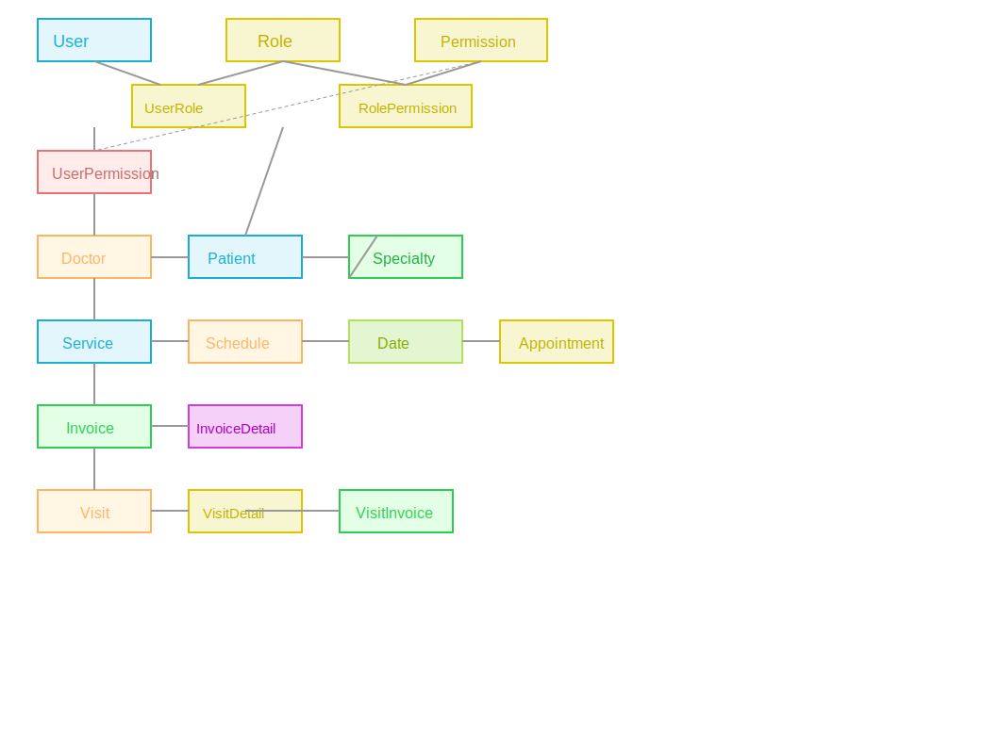

# 🏥 Clinic System Backend

A robust backend system for managing medical clinics, built with modern technologies. This project covers patient management, doctors, appointments, authentication, admin controls, and more — production-ready with Docker support and full API documentation.

---

## 🚀 Features

- Full patient management (CRUD)
- Doctor profiles and schedules
- Appointment booking, updating, and cancellation
- Secure JWT authentication
- User roles (Patient / Doctor / Admin)
- API documentation (Swagger)
- Ready for Docker deployment
- Centralized logging & error handling
- Modular, clean architecture

---

## 🛠️ Tech Stack & Tools

| Tool / Technology       | Usage                              |
|------------------------|-------------------------------------|
| **Node.js**            | Runtime environment                 |
| **TypeScript**         | Static typing                       |
| **NestJS**             | Main backend framework              |
| **Prisma ORM**         | Database modeling & migrations      |
| **MySQL**              | Primary database                    |
| **Joi**                | Input validation                    |
| **JWT**                | Authentication                     |
| **Routing Controllers**| API routing organization            |
| **Docker**             | Deployment & containerization       |
| **Swagger**            | API documentation                   |
| **Jest**               | Testing                             |

---

## 🧩 Project Structure

clinic_system/
│
├── src/
│ ├── modules/
│ │ ├── patient/
│ │ ├── doctor/
│ │ ├── appointment/
│ │ ├── auth/
│ │ └── admin/
│ ├── common/
│ ├── main.ts
│ └── app.module.ts
├── prisma/
│ ├── schema.prisma
│ └── migrations/
├── docker/
├── .env.example
├── README.md
└── package.json


---

## 🗄️ Database ERD (Entity Relationship Diagram)

The main entities in the system and their relationships:

- **Patient**: Has many Appointments
- **Doctor**: Has many Appointments
- **Appointment**: Belongs to one Patient and one Doctor
- **User**: (Parent table for authentication, extended by Patient, Doctor, or Admin)

**Simplified ERD diagram:**
User (id, email, password, role)
├── Patient (userId, ...patientData)
└── Doctor (userId, ...doctorData)
Appointment (id, patientId, doctorId, date, status, ...)




---

# Optional: Run with Docker
docker-compose up --build
🔐 Authentication
JWT-based authentication for all users.

Role-based authorization (Patient, Doctor, Admin).

Auth module handles registration, login, and password reset.

API endpoints protected with guards and authorization.

📅 Appointments Management
Patients can create, view, update, or cancel appointments.

Doctors can manage their schedules and appointments.

Admin can monitor and manage all appointments.

📝 Main API Endpoints
Endpoint	Description
/api/auth/*	Register, login, password reset, etc.
/api/patients/*	CRUD operations for patient profiles
/api/doctors/*	CRUD & schedules for doctors
/api/appointments/*	Booking, updating, canceling appointments
/api/admin/*	Admin dashboard and management

🐳 Docker Support
Easily run the system in containers using docker-compose up --build

Configure environment variables for DB and secrets as needed

🧪 Testing
(If available)
Automated unit and integration tests are provided using Jest.

📚 API Documentation
Swagger UI available at /api/docs (if enabled in the main server file).

🤝 Contributing
Pull requests are welcome! For major changes, please open an issue first to discuss what you would like to change.

📬 Contact
For questions or support, please open an issue or contact the repo owner.


## 📦 Installation & Running

```bash
# 1. Clone the repository
git clone https://github.com/zima563/clinic_system.git

# 2. Install dependencies
npm install

# 3. Configure environment variables
cp .env.example .env
# Edit .env with your DB credentials

# 4. Run Prisma generate & migrations
npx prisma generate
npx prisma migrate dev

# 5. Start the development server
npm run start:dev


